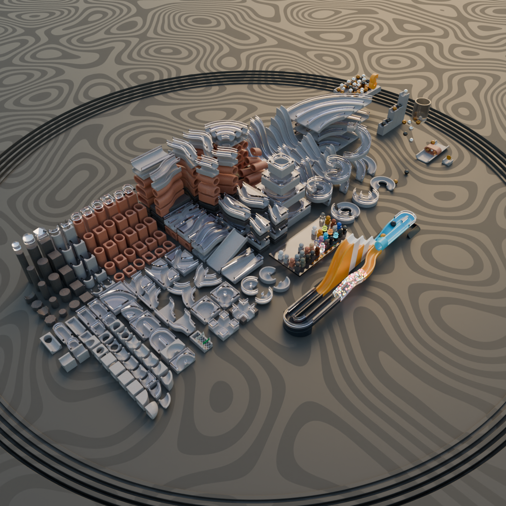
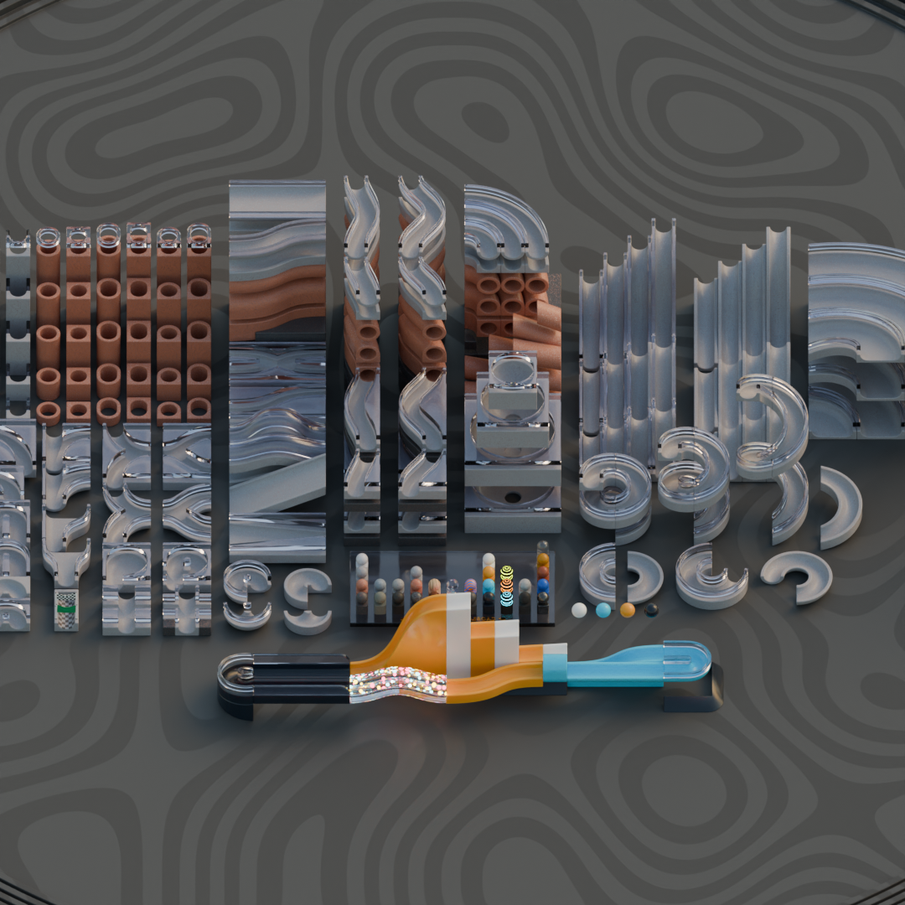

Marble Run Kit for Blender
==========================

A kit of parts for building marble runs in Blender.

There are over two hundred types of track to try out, including slides, ramps, tunnels, spirals, splits and bends. I've also built and included loads of procedural materials including terrazzo, granite, metallic, wood and glass for building a classy looking track.

It's designed around a basic block size of 4x4x2cm allowing a 2.5cm marble size.

A little demo scene is included.

Enjoy!

https://dpt.itch.io/marble-kit

## Related

https://github.com/dpt/LEGOKit
